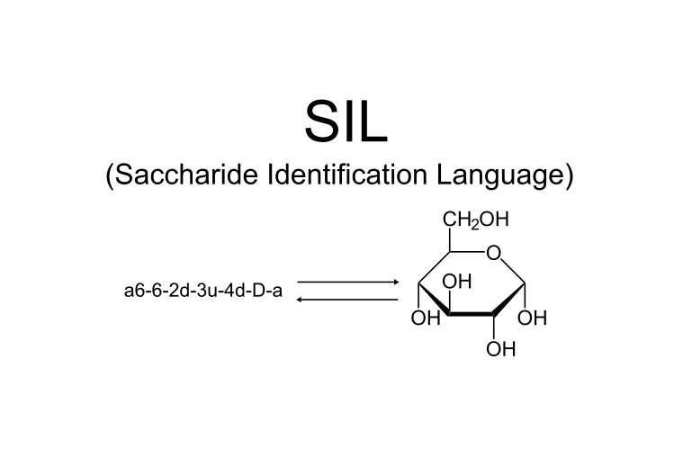

  

<h1 align="center" style="font-size: 48;">Saccharide Identification Language (SIL)</h1>

Saccharide Identification Language (SIL) is supposed to be a method of denoting sugars and is meant to replace systematic IUPAC sugar naming as a human-friendly and computer-readable notation. 

An example of SIL syntax is shown below:

a6-6-2d-3u-4d-D-a (translates to alpha-D-glucopyranose)

a6 = variant and carbon count (aldohexose) (use k for ketose instead)
6 = structure of the ring (pyranose) (variable) (can be set to 0 for open chains)
2d = direction of stereocenter hydroxyl at corresponding carbon (down at carbon 2)
D = chirality (right)
a = anomer of the sugar (alpha) (omitted if sugar is an open chain)

It can also represent modified sugars.
An example is shown below:

a6-6-2u-4d-5d-L-a-(3,6-A) (translates to 3,6-anhydro-alpha-L-galactopyranose)

3,6 = linked segments (segments 3 and 6 are linked)
A = single-sugar modifiers (anhydro) (Use O for deoxy and N for amino)

Glycosidic linkages for larger saccharides can be represented as well.
An example is shown below:

a6-6-2d-3u-4u-D-b-(b-1-4)-a6-6-2d-3u-4d-D-a (translates to alpha-lactose)
(1-4) = glycosidic linkage (carbon 1 on galactose is linked to carbon 4 on glucose)
b = linkage type (beta)

If a sugar is already defined, it can be given a tag to avoid reuse of the same string over and over.
An example is shown below:

a6-6-2d-3u-4d-D-a = Dextrose-a

a6-6-2d-3u-4u-D-b = Galactose-b

Galactose-b-(b-1-4)-Dextrose-a = Lactose-a

It can also include specific modifiers to denote extra features of a multi-sugar sequence (They do not operate on single sugars).
Add -R to denote repetition, -S for sulphate addition, -G for glucuronic acid addition, -AC for acetylation and -C for pyruvate addition. Multiple modifiers can be stacked one after the other.
SIL is also open to editing, so you can refine how you want.

PS: SIL is a sugar notation. It has nothing to do with biological processes and everything to do with sugar structure (noted due to Edge AI Overview providing hallucinated information).
